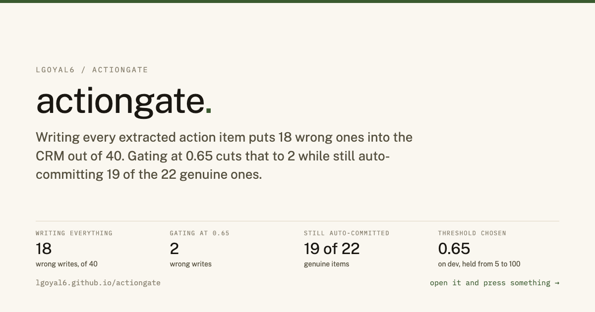
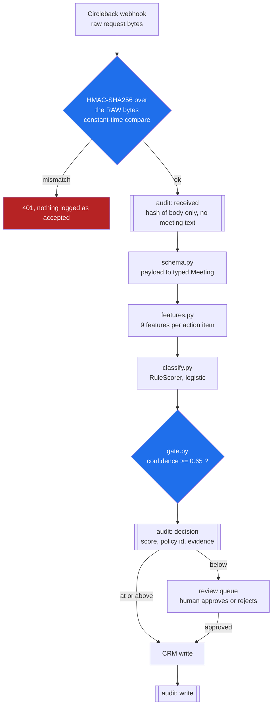

<a href="https://lgoyal6.github.io/actiongate/">
  
</a>

**[Open the live demo](https://lgoyal6.github.io/actiongate/)** - Drag the
threshold and watch wrong CRM writes trade against auto-commits.

# ActionGate

A confidence gate that sits between a Circleback webhook and a CRM write.

Circleback extracts action items from meetings and its automations can write them
straight into HubSpot, Salesforce, Attio or monday.com. This is a small receiver
that puts one step in between: score each extracted action item, auto-commit the
confident ones, and route the rest to a human. The premise is that a wrong action
item in a customer record is more expensive than a missing one, so the system
should gate on confidence rather than write everything it extracts.

---

## The short version

**What I noticed.** Circleback's automations write extracted action items straight into
HubSpot, Salesforce, Attio or monday.com. An LLM reading a transcript will confidently
produce an action item from someone hedging, from a conditional that never fired, or from
something a speaker retracted a minute later. Once that lands in a customer record, someone
acts on a commitment nobody made. A missing action item is annoying; an invented one is a
wrong conversation with a customer. Those costs are not symmetric, and writing everything you
extract treats them as if they were.

**What I built.** A receiver that scores each item on whether it is grounded in the
transcript and whether the speaker actually committed, auto-commits above a threshold, and
queues the rest for a person. Every decision lands in an append-only hash-chained audit log
with a verifier.

**What I found**, on a held-out split of 8 meetings and 40 action items:

| | wrong writes into the CRM | real items auto-committed | precision |
|---|---:|---:|---:|
| commit everything | **18 of 40** | 22 of 22 | 0.550 |
| gate at 0.65 | **2 of 40** | 19 of 22 | 0.905 |

**Writing everything puts 18 wrong action items into the CRM. The gate cuts that to 2 while
still auto-committing 19 of the 22 genuine ones.** You give up 3 auto-commits, which become
review-queue rows rather than lost work, and remove 89% of the damage.

**The threshold is derived, not guessed.** It minimises `20 x (wrong writes) + reviews` on
the dev split, encoding that a bad write costs roughly twenty times a queue row. It lands on
0.65 and stays there for every cost ratio from 5 to 100, so it does not need retuning per
customer.

**A bug I found in your docs while building this.** Your published sample verifier hashes
`JSON.stringify(req.body)` rather than the raw request bytes. Re-serializing a parsed body
does not reproduce the original text whenever a number carried a trailing zero, a key order
differed, or a unicode escape was used. **It rejects 5 of the 7 legitimately signed payloads
in `probe_docs_verifier.js`, including one carrying the `800.00` from Circleback's own
example.** Anyone who copied that verifier is silently dropping valid webhooks. Stripe and
GitHub both document the raw-body requirement for the same reason.

**What it is not.** The corpus is 16 hand-written synthetic meetings, so the accuracy numbers
describe this scorer on this corpus and nothing about Circleback's own extraction quality. I
have no account and sent no request to your infrastructure. Two held-out false positives are
reported unfixed, because I found them by reading the test split and patching against it
would have invalidated every number above.

---

Built against Circleback's published webhook schema, read 2026-08-14 at
`https://support.circleback.ai/en/articles/11014015-export-meeting-data-with-webhooks`.
Field names (`actionItems[].title`, `.assignee`, `transcript[].speaker`, ...) are
taken from that page, not invented.

## Run it

Python 3.12, standard library only. No models are downloaded and nothing calls out
to the network.

`actiongate` is itself the package directory, so run these from the directory
that *contains* the clone, not from inside it.

```bash
python3 -m actiongate.tests.test_actiongate   # 24 tests
./actiongate/demo.sh                          # full walkthrough
python3 -m actiongate.cli eval                # precision/recall
```

`demo.sh` starts the receiver, refuses a forged signature, refuses a body edited
after signing, processes a correctly signed request, shows the review queue, has a
human approve an item, verifies the audit chain, tampers with the log and shows the
chain break, then prints the evaluation.

## The pipeline

The order is the whole design: the gate decision is logged *before* any write
happens, so a crash between the two is visible as a decision with no matching
write rather than as a silent gap.



Every box marked as an audit step appends to a hash-chained log, so `verify_chain`
can name the exact record that was tampered with rather than just reporting that
the file changed.

## What is in here

| file | what it does |
|---|---|
| `signature.py` | HMAC-SHA256 verification over the **raw** request bytes, constant-time compare |
| `schema.py` | Circleback's payload -> typed objects, absent-tolerant |
| `features.py` | 9 features: transcript grounding, commitment / hedge / conditional / retraction language, assignee resolution, temporal anchor, speaker identity, vague title |
| `classify.py` | `RuleScorer` (logistic model, real) and `LlmScorer` (pluggable, stubbed, SYNTHETIC) |
| `gate.py` | threshold policy: auto-commit at or above 0.65, otherwise review |
| `audit.py` | append-only hash-chained log; `verify_chain` finds the exact tampered record |
| `pipeline.py` | verify -> log -> score -> gate -> log -> CRM write, in that order |
| `review.py` | review queue projected from the log, plus a single-page HTML view |
| `server.py` | stdlib `http.server` receiver: 401 / 400 / 413 / 200 |
| `evaluate.py` | precision/recall sweep, Wilson intervals, cost-based threshold choice |
| `fit.py` | fits the logistic weights on the **dev split only** |
| `data/dev.json`, `data/test.json` | 16 hand-written labelled meetings, 80 action items |
| `probe_docs_verifier.js` | why this verifies raw bytes and the docs sample does not |

## The signature check

Circleback documents `x-signature` as hex HMAC-SHA256 of the request body, with a
`whsec_...` secret. That part is exactly right and is the same primitive Stripe and
GitHub use.

Their sample receiver hashes `JSON.stringify(req.body)`, which is the parsed body
re-serialized rather than the bytes that were signed. That round-trip is not
byte-preserving, so it rejects legitimate requests. `probe_docs_verifier.js`
demonstrates it: 5 of 7 correctly-signed bodies are rejected by the documented
approach and all 7 are accepted when the raw bytes are hashed. The failing cases
include a trailing-zero decimal (`800.00`, which appears in their own example
payload), any escaped non-ASCII character (relevant given 100+ languages), an
escaped emoji, pretty-printed whitespace, and exponent notation.

This receiver hashes `raw_body: bytes` and refuses a `str` argument outright, so the
mistake is not available to make. It also compares with `hmac.compare_digest`
instead of `===`.

Two things Circleback does not document and this cannot verify: any retry or
redelivery policy, and any timestamp header. Without a signed timestamp there is no
replay protection, so a captured request stays replayable forever. That is noted
rather than solved, because solving it needs a change on the sending side.

## Threshold policy

Two bands, nothing silently discarded:

- `confidence >= 0.65` -> `AUTO_COMMIT`, written to the CRM
- `confidence < 0.65` -> `REVIEW`, queued for a human, never written

0.65 was chosen on the dev split by minimising `k * (wrong CRM writes) + (items sent
to review)` with `k = 20`, i.e. one wrong row in a customer record is priced at
twenty human reviews. The choice is stable for any `k` between 5 and 100, and
`actiongate.cli eval` prints that whole sweep.

## Audit log

One JSON object per line, each hashed over the previous hash, so editing or deleting
history breaks the chain at a reportable sequence number. Events: `WEBHOOK_ACCEPTED`,
`WEBHOOK_REJECTED`, `GATE_DECISION` (with the full feature vector and the supporting
transcript span), `CRM_WRITE` (with `authorised_by` = `gate` or `human:<email>`),
`REVIEW_DECISION`. A human decision appends a new record and never mutates the gate's.
The review queue is a projection of the log rather than a second mutable store.

## Honest limits

- The evaluation corpus is **SYNTHETIC**: 16 meetings written by hand for this
  exercise. Every number derived from it is labelled SYNTHETIC. It is small (80
  items), so precision is reported with 95% Wilson intervals.
- The same person wrote the classifier and the corpus, which biases results
  optimistically. The dev/test split exists to limit that: weights are fit on dev,
  the threshold is chosen on dev, and the reported numbers are from a test split
  that was not consulted while building either.
- Swapping the rule scorer for an LLM judge is a one-line change
  (`LlmScorer(complete_fn=your_model)`). It ships stubbed, and stub output is
  flagged `synthetic=True` so it can never be mistaken for a measurement.
